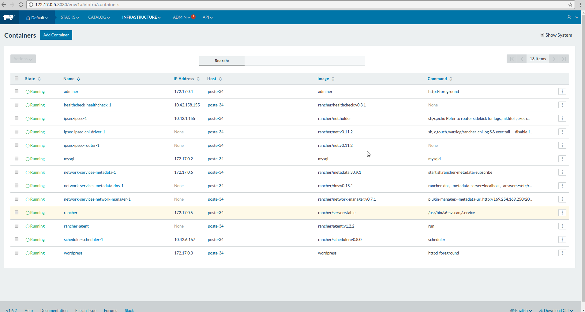

# Validation Docker
Validation développement d'une architecure applicative

## Présentation

- **Création de 4 conteneurs Docker :**
  - apache2
  - mysql
  - adminer
  - rancher/server

- **Sécurisation de l'architecture :**
  - Installation et config cron **logwatch** (pour recevoir les logs du serveur par mail)
  - Installation de **fail2ban** et configuration pour contrer les attaques "Brute force" (ssh) et les attaques DOS (http/get)
  - Installation et config cron **rkhunter**
  - Installation et config cron **chkrootkit**

## Installation
- Lancer le script _**./init.sh**_
  - Installation des 4 conteneurs dockers
  - Lancement du script pour une sécurisation de base du serveur

- Si code d'erreur (suite à une modif de la BDD), exécuter ces étapes :
  - Ouvrir un nouveau terminal et saisir la commande : _docker inspect 'rancher' | grep '"IPAddress"'_  ('rancher' étant le nom du conteneur)
  - Copier l'adresse IP retournée
  - Ouvrir un navigateur web
  - Se rendre sur l'adresse IP retournée (avec le port 8080)
  - Créer un nouveu Host ("Add host") sur le site et générer la requête de l'étape 4 après avoir cliquer sur le bouton Save
  - Copier/Coller la requête (sans le sudo) dans le terminal, et attendre.
  - Rafraichir la page Host. Les relations sont maintenant effectives.

## Utilisation
- Adminer : http://localhost:4001
- Apache : http://localhost:4000
- Rancher : http://localhost:9090 (ou l'adresse IP retournée par la commande _docker inspect 'rancher' | grep '"IPAddress"'_ en port 8080)

- Possibilité de visualiser les logs d'installation dans le fichier _'./init.log'_

## Problèmes rencontrés
- Suite à des erreurs de droits, on a dù basculer de docker-compose à docker (méthode manuelle)
-

## About

Réalisé par :
- LERBRET Maxime (DEV 9)
- SANDRON Dimitri (DEV 9)

IT-AKADEMY - Juin 2017
